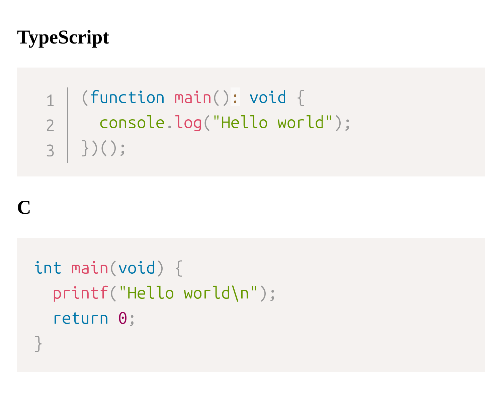

# @u1f992/rehype-spectroscope

[Prism](https://prismjs.com/), running within [JSDOM](https://github.com/jsdom/jsdom?tab=readme-ov-file#interfacing-with-the-nodejs-vm-module-using-getinternalvmcontext). Provides similar effects to [wooorm/refractor](https://github.com/wooorm/refractor) while offering broader compatibility with official Prism plugins.

```
$ npm install git://github.com/u1f992/rehype-spectroscope#v0.1.0
```

```javascript
// @ts-check

import { spectroscope } from "@u1f992/rehype-spectroscope";

import { VFM } from "@vivliostyle/vfm";
// import { concentrator } from "@u1f992/rehype-concentrator";

/** @type {import('@vivliostyle/cli').VivliostyleConfigSchema} */
const vivliostyleConfig = {
  title: "example",
  author: "u1f992",
  theme: "./css",
  entry: ["manuscript.md"],
  documentProcessor: (opts, meta) =>
    VFM(opts, meta)
      // .use(concentrator)
      .use(spectroscope, {
        languages: ["c", "css", "typescript"],
        plugins: ["line-numbers"],
      }),
};

export default vivliostyleConfig;
```

Use with line-numbers plugin:



## License

GPL-3.0, except for the `example/` which is licensed under CC0-1.0.
